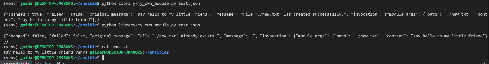
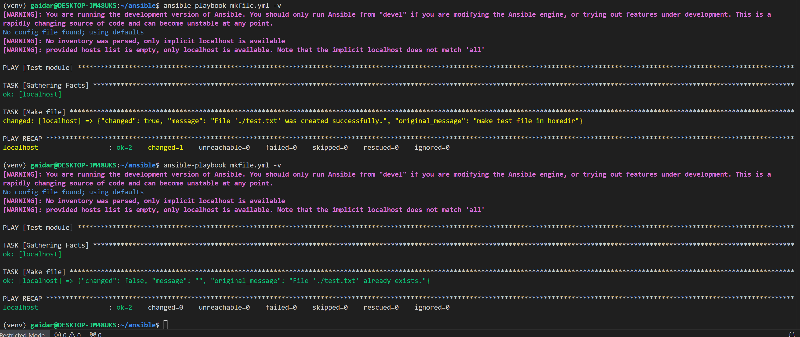
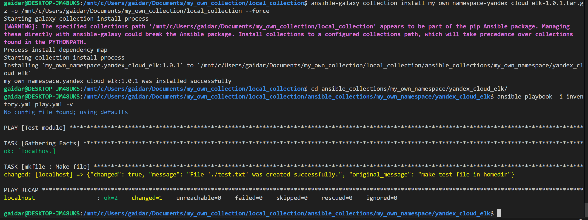

# Домашнее задание к занятию 6 «Создание собственных модулей»

## Локальная проверка модуля

## Проверка модуля через плэйбук + идемпотентность

Установка коллекции из архива *.tar.gz и проверка роли

[Ссылка на репозиторий с коллекцией v1.1.0](https://github.com/gaidarvu/my_own_collection/tree/1.1.0/my_own_namespace/yandex_cloud_elk)

[Архив с коллекцией *.tar.gz](local_collection/my_own_namespace-yandex_cloud_elk-1.0.1.tar.gz)